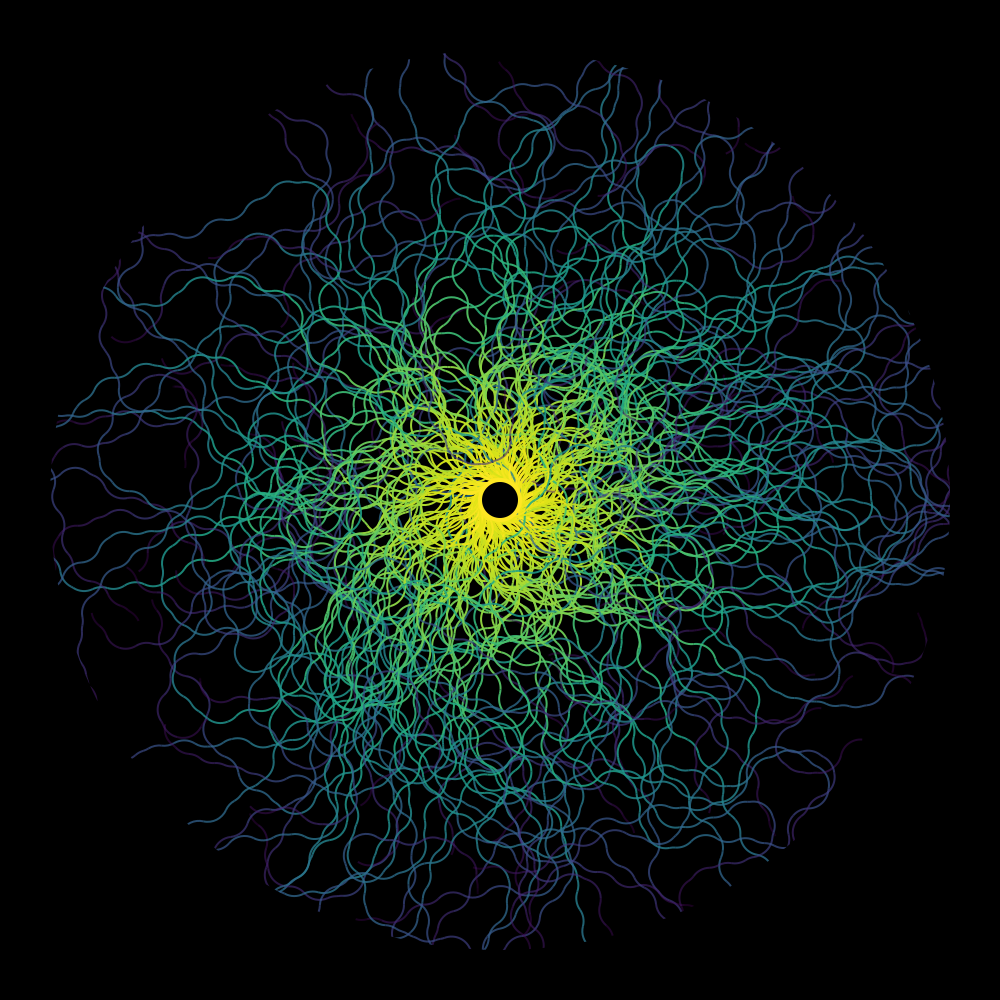
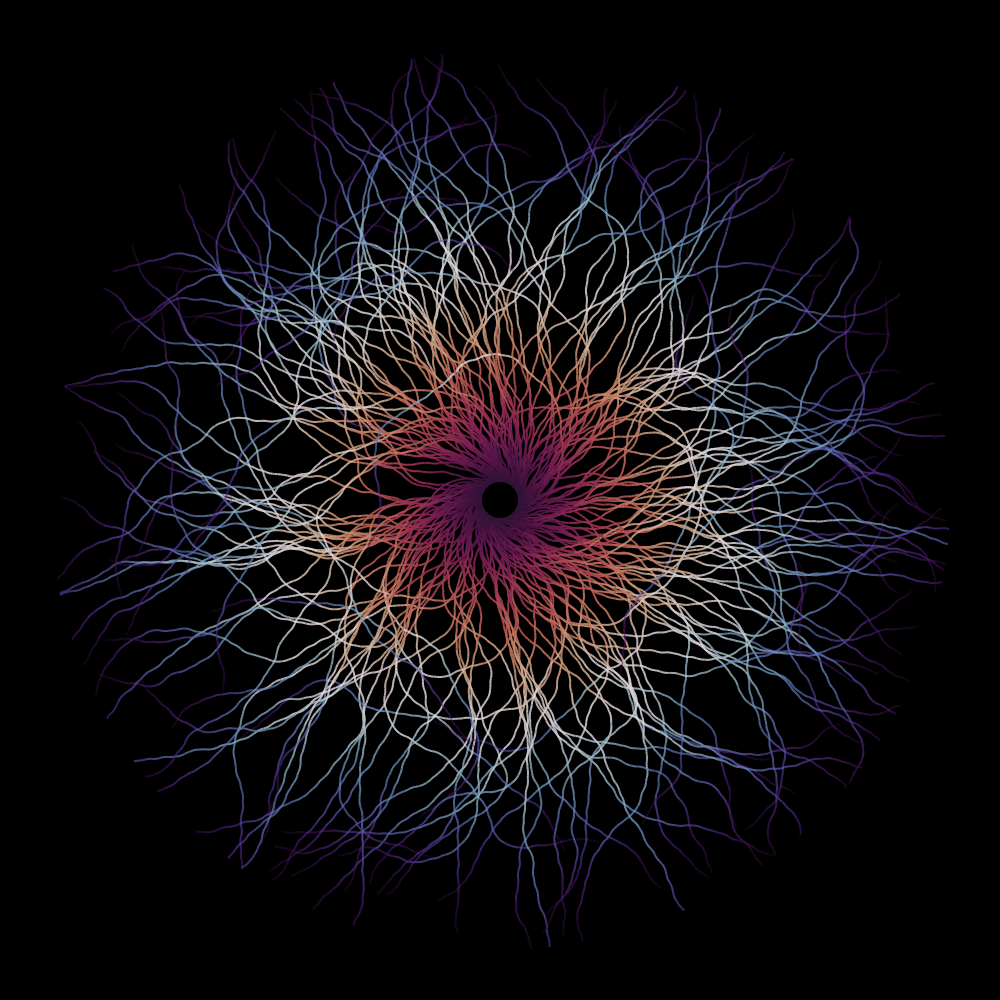
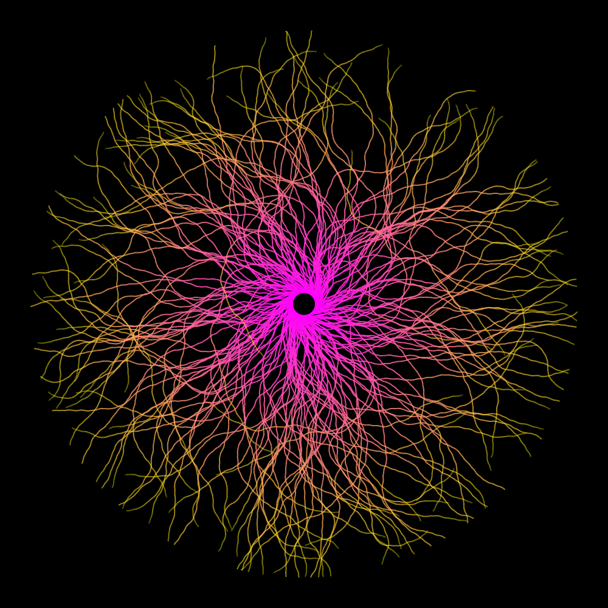
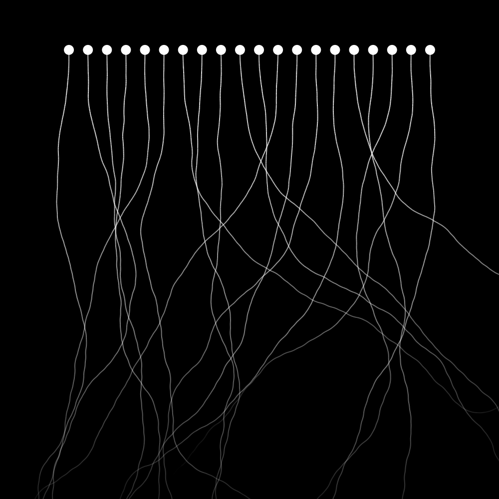
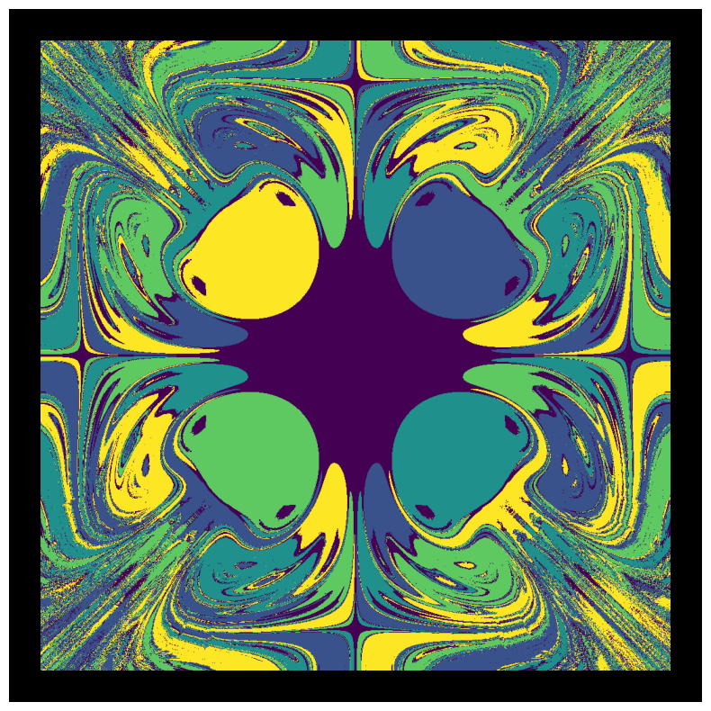
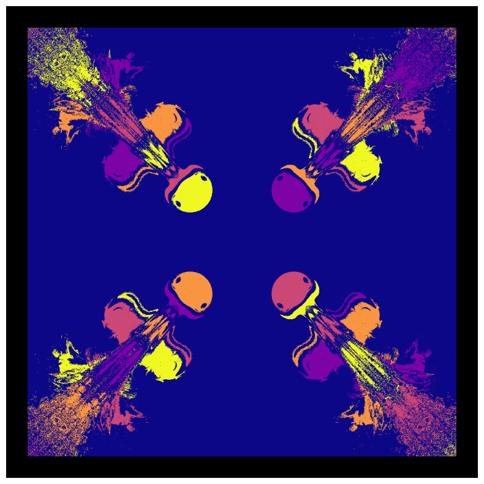
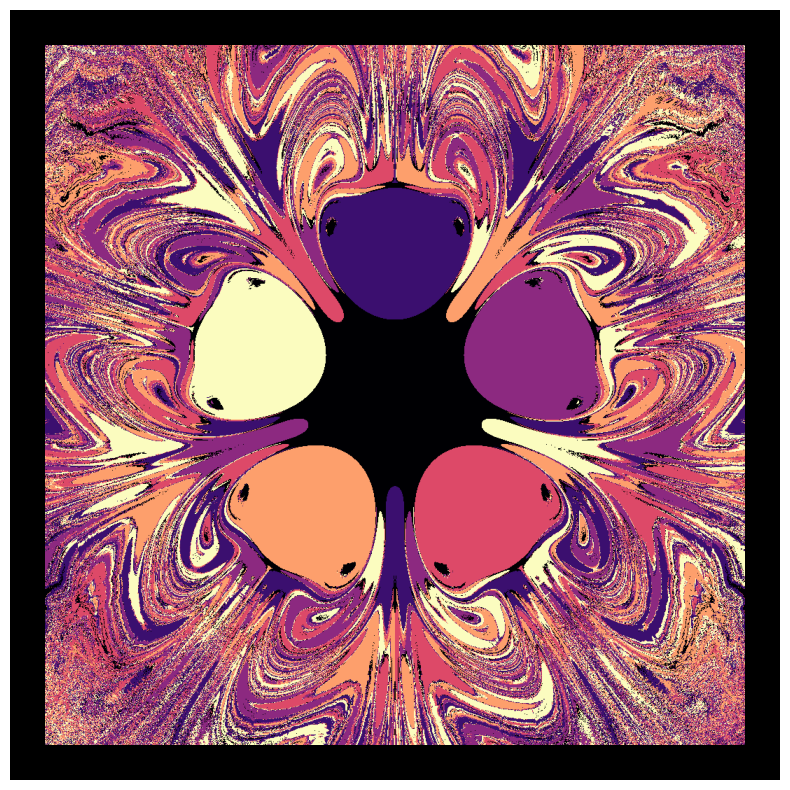
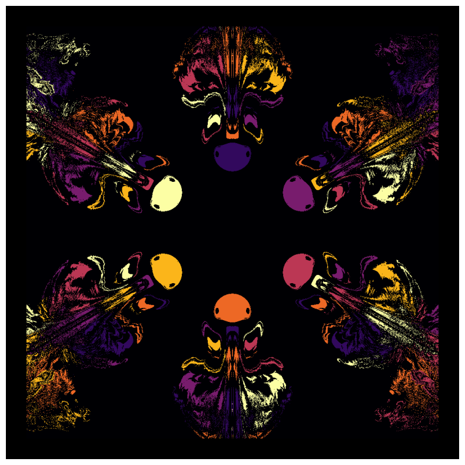

# Generative Art Experiments

A collection of generative art projects exploring stochastic processes, geometric constructions, and physical simulations.

This repository focuses on:

* Random walk–based pattern generation
* Geometric transformations (arcs, lattices)
* Physics-inspired simulations (magnetic pendulum attractors)

---

## Gallery

### Angular Random Walk

<p float="left">
  
  
  
</p>

Patterns generated from stochastic angular steps with varying curvature and color mappings.

---

### Angular Rundown

<p float="left">
  
</p>

A structured variant with controlled step scaling and spatial layout.

---

### Magnetic Pendulum

<p float="left">
  
  
  
  
</p>

Simulation of a damped pendulum in a multi-attractor field.
Each pixel corresponds to the attractor reached from a given initial condition.

---

## Project Structure

```bash
angular_random_walk/
    scripts for geometric random walk patterns

magnetic_pendulum/
    simulation + visualization of attractor basins

```

---

## How to Run

### Angular Random Walk

```bash
python angular_random_walk/angular_random_walk_01.py
```

### Magnetic Pendulum

```bash
python magnetic_pendulum/render_pendulum.py
python magnetic_pendulum/plot_pendulum.py pendulum_01
```

---

## Notes

* Outputs are intentionally stochastic → results vary per run
* High-resolution outputs are not committed to keep the repo lightweight
* The gallery contains curated examples

---

## Motivation

This project explores how simple local rules and stochastic processes can generate complex global structure, a theme common to both physics and generative art.
